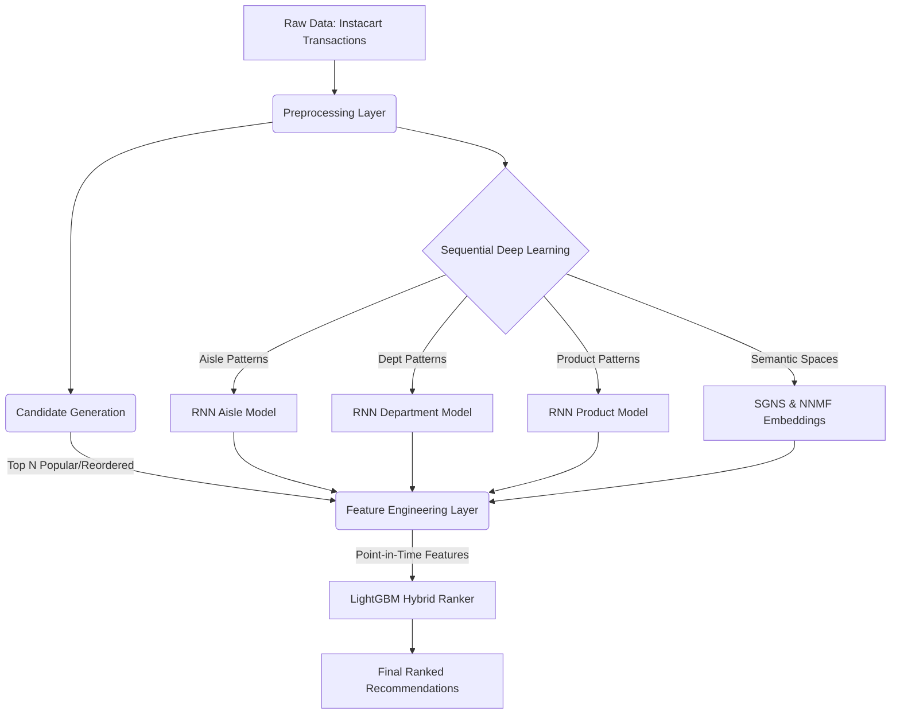

# 🏗️ System Architecture: Instacart Recommendation Engine

This document provides a deep dive into the architecture, data flow, and components of the Instacart Recommendation Engine.

## High-Level Data Flow

The system operates as a multi-stage pipeline, transforming raw transaction logs into heavily engineered sequential features, which are then scored by a hybrid LightGBM Ranker.

## Component Breakdown

### 1. Preprocessing Layer (`preprocessing/`)
Responsible for ingesting raw Instacart CSVs and converting them into chronologically strict user histories.
- Creates `user_data.csv` and `product_data.csv`.
- Ensures zero data leakage by masking order `N` (the target) while computing features from orders `1` to `N-1`.

### 2. Deep Sequence Models (`models/rnn_*`, `models/sgns/`, `models/nnmf/`)
Instead of treating products as isolated items, the engine learns the temporal trajectory of a user's shopping habits.
- **RNN Aisle/Department/Product:** LSTMs/GRUs trained to predict the next aisle or product category a user will shop from.
- **SGNS (Skip-Gram Negative Sampling):** Learns product embeddings (similar to Word2Vec) based on co-occurrence in shopping baskets.
- **NNMF (Non-Negative Matrix Factorization):** Captures latent user-item affinities.

### 3. Feature Engineering & Blending (`models/blend/`)
Extracts point-in-time features for the generated candidates:
- **Recency/Frequency:** Days since prior order, historical reorder rates.
- **Sequential Features:** Purchase trend ratios, `seq_recency_last_order`.
- **Model Scores:** Outputs from the RNNs and embeddings are appended as dense features for the final ranker.

### 4. The Champion Ranker (`models/phase4/`, `run_inference.py`)
A highly optimized **LightGBM LambdaRank** model that takes the engineered features and assigns a final ranking score to the candidate pool.
- **Objective:** `lambdarank` (optimized for NDCG).
- **Inference Latency:** Designed for extreme efficiency, averaging ~2.45ms per user.

### 5. Forensic Validation (`models/phase5/`, `tests/`)
A rigid, 27-phase testing framework that mathematically proves the model's superiority.
- Validates that sequential features drive causal improvements (via shuffle testing and feature ablation).
- Locks the champion model binary using SHA256 checksums (`tests/project_health_check.py`).
